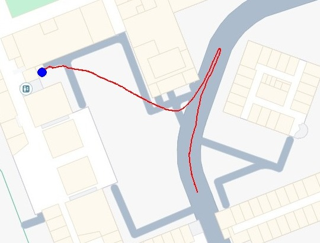
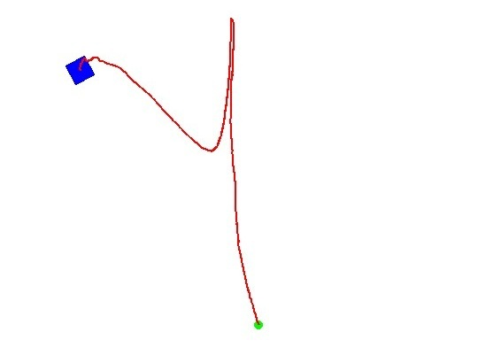

# Agrihusky: Velocity controller for GPS point-to-point navigation

This repository contains the implementation of a husky controller that receives position updates from GPS coordinates and orientation information from an onboard IMU. Two packages are available: ROS1 Noetic and ROS2 Humble.

1. The first package includes an initial test on GPS data obtained using the [Ericsson-GNSS-RTK-ROS-package](https://github.com/LTU-RAI/Ericsson-GNSS-RTK-ROS-package/tree/main) ROS1 Noetic implementation. 
2. The second package includes the velocity controller and waypoint publisher along with fake sensor publishers. The simulation uses the fake readings the same GPS data as (1) and the [Ericsson-GNSS-RTK-ROS-package](https://github.com/LTU-RAI/Ericsson-GNSS-RTK-ROS-package/tree/ros2) ROS2 Humble implementation.

## Controller Description

The topics subscribed and published by the controller include:

```
# Publisher Topics
/husky_planner/cmd_vel  : Twist      : The velocity command

# Subscriber Topics
/ublox_client           : UbxNavPvt  : The GPS message (Global position)
/imu/data               : Quaternion : The IMU message (Local Orientation)
/husky_planner/waypoint : Point      : The objective location
```

* Waypoints are published as coordinates from a .txt file and read by the controller as the next objective location.
* GPS coordinates are transformed from [UbxNavPt](https://github.com/KumarRobotics/ublox/blob/ros2/ublox_msgs/msg/NavPVT.msg) in latitude/longitude degrees to local frame in meters.

The controller and waypoint publisher are launched by running the following commands:

```
source ros2_ws/install/setup.bash          # Ensure sourcing of built packages

ros2 run agrihusky controller.py           # Publishes velocity commands
ros2 run agrihusky fake_waypoing_pub.py    # Publishes waypoints
```

## Simulation

The simulation on the ROS1 package is a test of previously GPS recorded data on surrounding LTU facilities as seen on Image 1. 

The ROS2 package simulates odometry and GPS readings from the Husky platform. Using the points from the testing GPS data as waypoints to check the global to local frame transformation, the controller generates velocities that update the local and global position. A resulting simulation can be seen on Image 2.

<table>
    <tr>
        <td>
            
            <p align='Center'>Global position from GPS readings</p>
        </td>
        <td>
            
            <p align='Center'>Local position from GPS-to-Meters transformation</p>
        </td>
    </tr>
</table>

The topics subscribed and published by the fake sensors that are used by the Husky during simulation include:

```
# Subscriber Topics
/husky_planner/cmd_vel  : Twist         : The velocity command

# Publisher Topics
/husky/gps              : PointStamped  : The GPS message (Global position)
/husky/odom             : Odometry      : The Odometry message (Local position and orientation)
```

The simulatioin is launched by running the following commands:

```
# Package ROS1 Noetic
source ros1_ws/devel/setup.bash             # Ensure sourcing of built packages
roslaunch agrihusky gps_map.launch          # Visualization of GPS test data on map

# Package ROS2 Humble
source ros2_ws/install/setup.bash           # Ensure sourcing of built packages
ros2 launch agrihusky simulation.launch.py  # Controller + visualization + fake sensors
ros2 run agrihusky fake_waypoing_pub.py     # Publishes waypoints
```